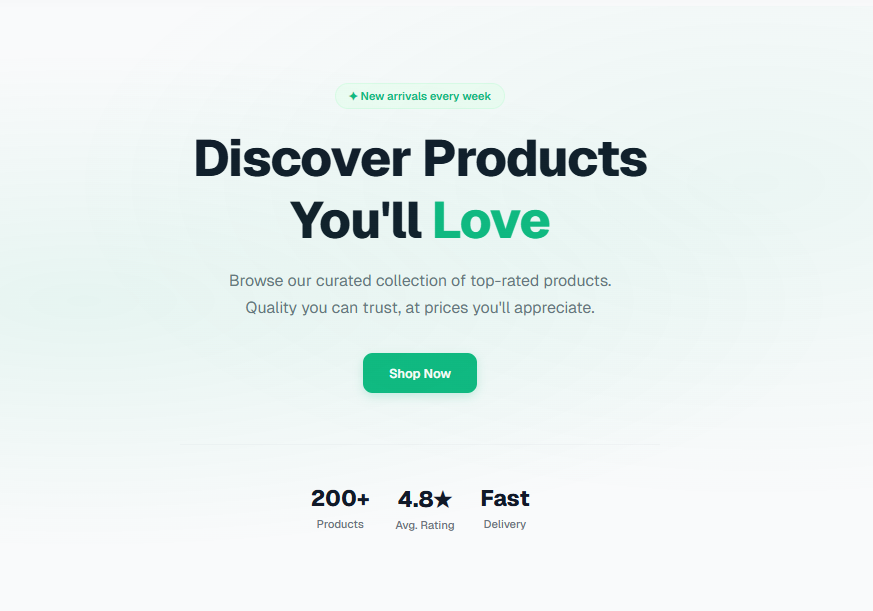
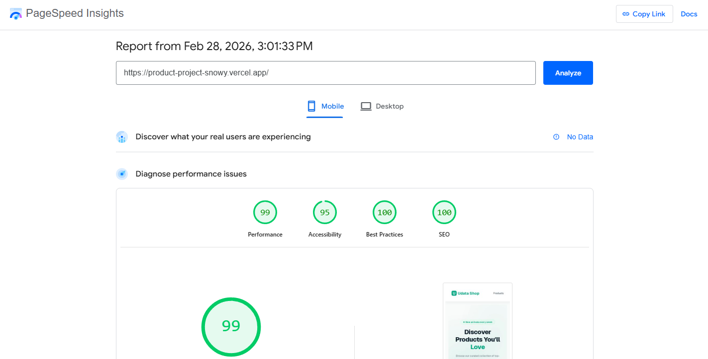

# Udata Shop

<p align="center">
  
</p>
**Udata Shop** is a modern e-commerce platform built with React and Next.js. The project demonstrates a product list with pagination, a detailed product page, a promo code system, and dark/light theme support.

## 🚀 Tech Stack

- **Framework:** [Next.js 15](https://nextjs.org/) (App Router)
- **Language:** [TypeScript](https://www.typescriptlang.org/)
- **State Management & Data Fetching:** [TanStack Query (React Query)](https://tanstack.com/query/latest)
- **Styling:** CSS Modules
- **Notifications:** [React Hot Toast](https://react-hot-toast.com/)
- **Themes:** [next-themes](https://github.com/pacocoursey/next-themes)
- **HTTP Client:** [Axios](https://axios-http.com/)

## 🛠️ Getting Started

1. **Clone the repository:**

   ```bash
   git clone <repository-url>
   ```

2. **Install dependencies:**

   ```bash
   npm install
   ```

3. **Run the development server:**

   ```bash
   npm run dev
   ```

4. **Open [http://localhost:3000](http://localhost:3000)** in your browser.

## 🎁 Available Promo Codes

The project includes a discount system. You can use the following promo codes at checkout:

| Promo Code       | Discount |
| :--------------- | :------- |
| **PROMO10**      | 10%      |
| **PROMO20**      | 20%      |
| **PROMO30**      | 30%      |
| **UDATATHEBEST** | 80%      |

---

PageSpeed test results:

<p align="center">
  
</p>

This project was created as a test assignment to demonstrate Next.js development skills.
